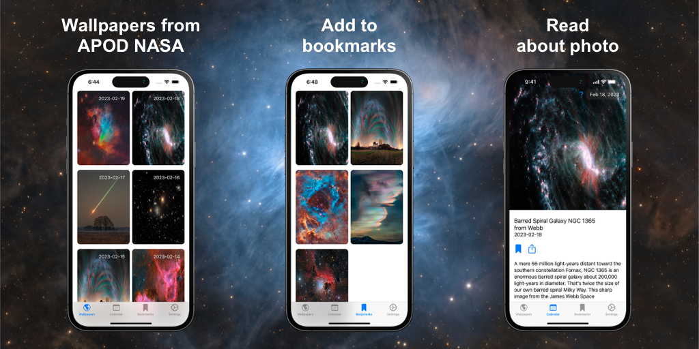

# NASA Wallpapers


NASA Wallpapers - app for view Astronomy Picture of the Day photo from NASA

Features:
• Get high-definition daily NASA APOD photos delivered right to your device.
• View additional info on every photo or video and share with friends.
• Save photos as device wallpaper.
• Browse, search, and view all previous APOD items.
• Bookmarks with your like photos. 

Enjoy the universe around you each and every day with the all new SpaceGeek APOD for iOS.

The copyright owner of the photo is listed below the photos. If the copyright owner is not specified, the copyright belongs to NASA.


## Architecture


## Languages, libraries and tools used

### Shared
- [Kotlin](https://kotlinlang.org/)
- [Ktor](https://github.com/ktorio/ktor)
- [Koin](https://github.com/InsertKoinIO/koin)
- [Kotlin Coroutines](https://kotlinlang.org/docs/reference/coroutines-overview.html)
- [Kotlinx Serialization](https://github.com/Kotlin/kotlinx.serialization)
- [DateTime](https://github.com/Kotlin/kotlinx-datetime)
- [SQLDelight](https://github.com/cashapp/sqldelight)

### Android
- [Android Architecture Components](https://developer.android.com/topic/libraries/architecture/index.html)
- [Jetpack Compose](https://developer.android.com/jetpack/compose)
- [Compose Calendar](https://github.com/mobile-development-group/ComposeCalendar/)
- [Coil](https://coil-kt.github.io/coil/)

### iOS
- [SwiftUI](https://developer.apple.com/documentation/swiftui)


## Project structure

This repository contains a common Kotlin Multiplatform module, a Android project and an iOS project. The common module is connected with the Android project via the Gradle multi-project mechanism. For use in iOS applications, the shared module compiles into a framework that is exposed to the Xcode project via the internal integration Gradle task. This framework connects to the Xcode project that builds an iOS application.


## How to build

### Android
Open project in Intellij IDEA or Android Studio and run "androidApp" configuration.

### iOS
Open and build the Xcode project located in "iosApp" folder. (Recomended)

If you encounter an error like `Error: can't grab Xcode schemes`, in Xcode, select **Settings/Preferences | Locations**. In the **Command Line Tools** field, select your Xcode.


#### OR
1. Open project in Android Studio
2. Edid configuration "iosApp".
3. Select simulator in "Execution target"
4. Run "iosApp" configuration.

## License
This project is licensed under the Apache-2.0 License - see the [LICENSE](LICENSE) file for details.

```
Copyright 2022-2023 Redume

Licensed under the Apache License, Version 2.0 (the "License");
you may not use this file except in compliance with the License.
You may obtain a copy of the License at

   http://www.apache.org/licenses/LICENSE-2.0

Unless required by applicable law or agreed to in writing, software
distributed under the License is distributed on an "AS IS" BASIS,
WITHOUT WARRANTIES OR CONDITIONS OF ANY KIND, either express or implied.
See the License for the specific language governing permissions and
limitations under the License.
```